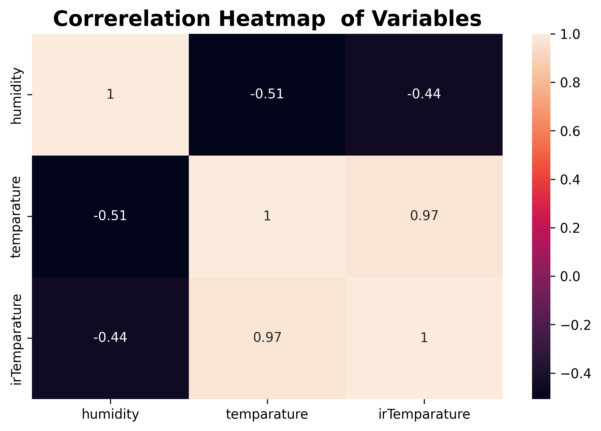
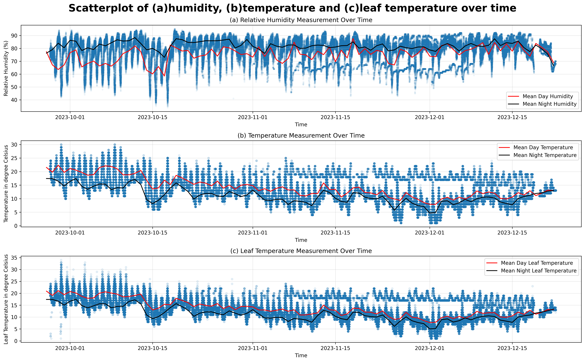
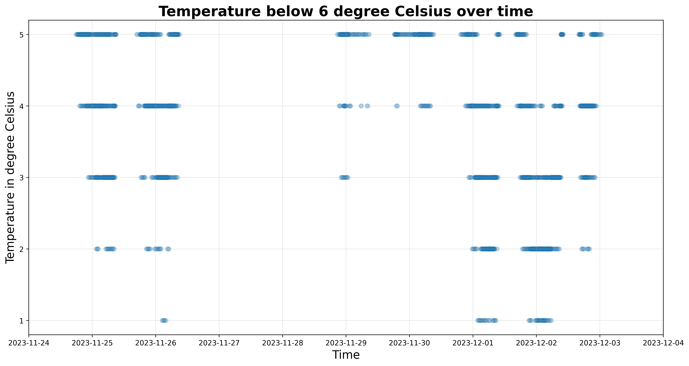
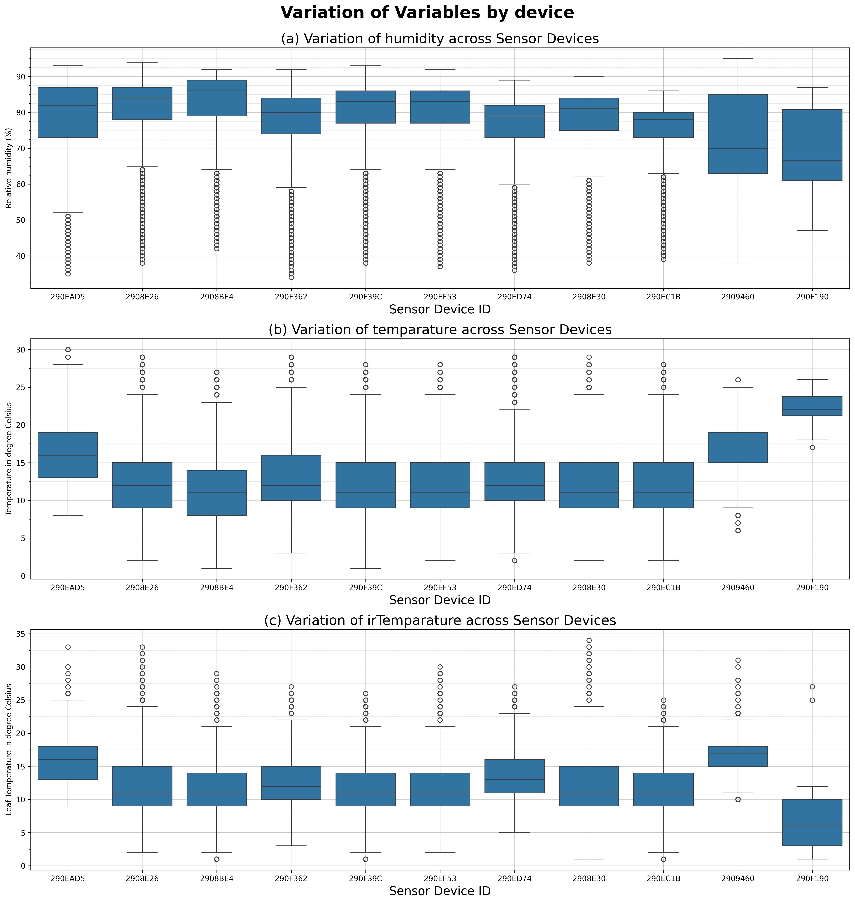

# MicroClimate Dataset Analysis
This repository presents a detailed analysis of the MicroClimate dataset, which includes measurements of relative humidity (RH), temperature, and leaf temperature within a greenhouse environment. The analysis aims to explore the fluctuations of environmental conditions throughout the day, assess the adequacy of greenhouse management practices for optimal strawberry production, and examine the variations in climate parameters across different sensor locations within the greenhouse.

Key questions are addressed through advanced visualizations and statistical methods, uncovering insights into the relationship between environmental factors and plant health. This analysis provides valuable information for optimizing greenhouse conditions to enhance plant growth and productivity.
Below is an example image of EDA performed for Question formation

## Question 1: Did the levels of RH, temperature, and leaf temperature fluctuate throughout the day in the 'MicroClimate' dataset, and if so, how did these fluctuations manifest?

The analysis revealed significant daily fluctuations in relative humidity (RH), temperature, and leaf temperature. By examining scatterplots with mean curves for both daytime (06:00-18:00) and nighttime (18:00-06:00), it was found that:
1.  RH: Mean RH was higher during the nighttime compared to the daytime.
2.  Temperature and Leaf Temperature: Both temperatures were higher during the daytime than at night, showing an inverse relationship with RH.
Further investigation into temperature variability across three time periods (00:00-08:00, 08:00-18:00, 18:00-00:00) indicated moderate variability (3-5°C) with peak temperatures during the day (15.009°C) and lower temperatures at night (10.915°C and 11.541°C). These fluctuations confirm a consistent pattern of daytime and nighttime differences for all three variables.

## Question 2: Were the greenhouse conditions adequately managed to ensure optimal strawberry production?
By comparing the temperature variability observed in the 'MicroClimate' dataset with literature values from studies in Chiang Mai (Thailand) and Copenhagen (Denmark), it was found that the temperatures in the dataset (mean of 12.774°C) were lower than the optimal range of 13.7°C to 14.8°C observed in the literature for strawberry production. Despite this, the low temperatures recorded in the dataset could be attributed to intentional chilling practices for inducing flowering, as suggested by the scatterplot of temperatures below 6°C, which peaked towards the end of October and early December. The gradual rise in temperature following these low periods likely signaled the transition of plants to the fruiting stage, which aligns with the predicted timing of flowering and fruiting.
Thus, it can be concluded that the greenhouse conditions were effectively managed to optimize strawberry production, with advanced techniques such as controlled chilling being employed to enhance productivity.

## Question 3: How do temperature and RH parameters vary across different locations within the greenhouse, considering the placement of devices in various positions?
An analysis of temperature and RH variations across different sensor locations within the greenhouse revealed slight location-based fluctuations. Boxplots for RH, temperature, and leaf temperature showed that:

1.  Some devices, such as '290F190', exhibited contrasting patterns in temperature and leaf temperature, likely due to limited data points.
2.  Other devices, like '2909460', recorded exceptionally low temperatures (18°C for temperature and 17°C for leaf temperature) and displayed a wider range of RH values.
Despite these discrepancies, the overall trend showed slight variation in the temperature and RH across most locations, with some devices showing unique patterns due to their specific measurement periods or data characteristics.

In conclusion, while temperature and RH parameters did vary slightly across different locations within the greenhouse, overall, the variations were not significant, except in certain sensor locations, such as '2909460'.
